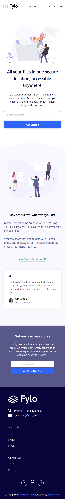

# Frontend Mentor - Fylo landing page with two column layout

This is a solution to the [Fylo landing page with two column layout challenge on Frontend Mentor](https://www.frontendmentor.io/challenges/fylo-landing-page-with-two-column-layout-5ca5ef041e82137ec91a50f5/hub).

## The challenge

Your challenge is to build out this page and get it looking as close to the design as possible.

## Screenshot

### Mobile Screenshot

### Desktop Screenshot

## Links

- Solution URL: --
- Live Site URL: --

## Built with

- HTML5
- CSS
- Flexbox
- CSS Grid
- Mobile First Workflow

## Author

- Frontend Mentor - https://www.frontendmentor.io/profile/Raink31
